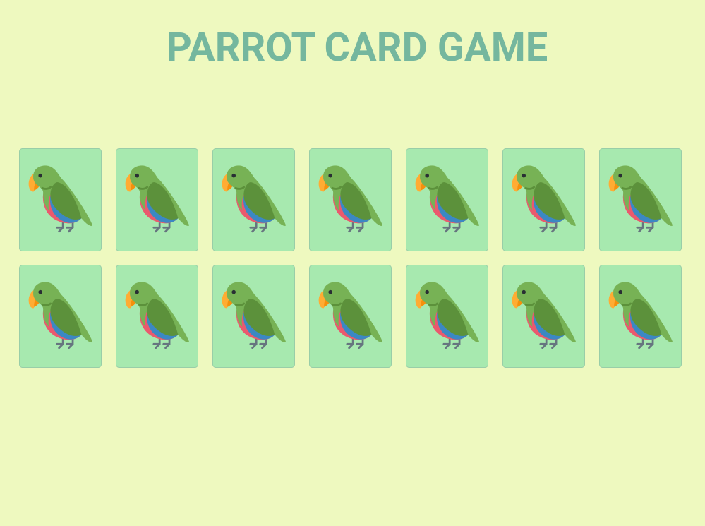

  

 
  
- Criação de um jogo da memória
   
- JavaScript puro

# Funcionalidades
- Opção de 4 até 14 cartas
- Cartas colocadas em posições aleatórias
- Objetivo de achar a carta correspondente ao par
- O tempo é cronometrado
- Quantidade de jogadas é salva

# Tecnologias 
- HTML5
- CSS3
- JAVASCRIPT
- GIT
- GITHUB
- VSCODE 

# Preview

  
   
   
  
Clique na imagem para acessar a página

 
